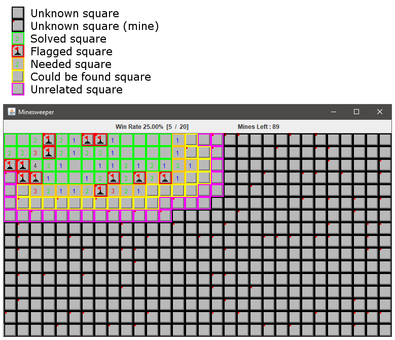

# MinesweeperAI
This AI works using linear algebra to compute all the possibilities of mine placements and selecting the most likely.

Solving Minesweeper is NP-complete based on work by Richard Kaye [Here](http://web.mat.bham.ac.uk/R.W.Kaye/minesw/ordmsw.htm) and [This](http://www.minesweeper.info/articles/MillionDollarMinesweeper.pdf). But since N is small most solutions *should* be solvable in our lifetime.

## Testing

Begginer: 90.6% correct (920,851 / 1,016,600)

Intermediate: 76.6% correct (772,289 / 1,008,853)

Expert: 38.1% correct (135,488 / 355,608)

## Stages of solving
The main AI algorithm takes in a board and decides where the next click(s) should be. If the board is new the initial click is in the top right based on Emmanuel Brunellire's calculated theoretical odds of creating an opening [Link](http://www.minesweeper.info/wiki/Strategy). Otherwise the AI uses the steps below.

### Stage 1: RuleSet
1. The squares are broken up into 3 groups
  * Numbered (0-8)
  * Unknown
  * Flagged
2. Finds all the numbered squares that are near an unknown square, these are the only squares it needs to calculate. It will color these orange and flag them as NEEDED. Each of these will create a new "Rule" that must be followed, it stores the unknown squares around it along with how many of them must be a mine. An additional Rule is created that all unknown spaces must have the exact amount of mines left on the board. If the solution that is created follows these Rules it is a valid possibility.

3. Any duplicate Rules are removed. 
  Ex: {1 mine in spaces (0,1) and (1,1)} and {1 mine in space (0,1)} 
  will be simplified to {1 mine in space (0,1)} and {0 mines in space (1,1)}
  
4. If any rules contain the same amount of squares as mines, or contain 0 mines they are added to the clickPoints queue because they are now known as either mines or empty spaces.

### Stage 2: Matrixes
If Stage 1 was unsuccessful at finding and new information in-depth analysis is needed.

1. A Matrix is created from the rules and using standard row operations the probability that each square is a mine is calculated. I really don't remember how this works as I wrote it 2 years ago. This 

2. If no perfect solution is found (square that is either 100% mine or empty) then the best possible solution is picked. This best solution is the square with the lowest possibility of being a mine (It might be better to flag a square that has a higher possibility of being a mine, but this could lead to it failing in the future on a 'perfect' solution). This is calculated by using the amount of combinations of each possible solution where that square is a mine. The need for grouping similar squares together and using BigInteger is created because of the amount of possibilities in the unknown squares that are not near numbered squares. Sometimes it is better to click a purely unknown square rather than the ones where you know little information. In this case the magenta squares near the Needed squares are prioritized because it could help to solve more unknowns.

## Additional
In a trial this AI solved 135,488 expert games out of 355,608 which makes a win rate of 38.1% +/- 0.1%.
This is better or the same as estimates for the theoretical maximum.

Durring this same trial the longest time it took to complete a board was 57.4 minutes (3446604ms), while the average of winning boards was 117ms, losing boards was 58ms and total average time was 81ms.

Resources

[Link](https://www.reddit.com/r/askscience/comments/szxxb/what_are_the_odds_of_winning_an_expert/)

[Link](http://nothings.org/games/minesweeper/)

Similar methadology as [This paper](http://www.minesweeper.info/articles/MinesweeperStatisticalComputationalAnalysis.pdf) on page 21 "level 3". Except they claim it is "not practical for any computer known to man"

